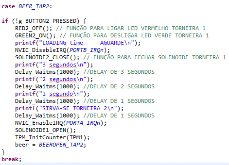

# CONCEIVE

O mercado de bares e pubs sempre foi uma grande procura das pessoas quando se fala em lazer, proporcionando uma experiência incrível tanto para os clientes quanto para os proprietários. Aliado a isto, existem os grandes gastos com garçons e desperdícios de produto, ocasionando uma insatisfação a todos, é válido ressaltar que a atratividade da tecnologia no bar abre vantagem contra aos concorrentes, trazendo agilidade e autonomia, reduzindo a insatisfação do cliente. Pensando nisso, a equipe MHL desenvolveu o automatizador de torneiras para chopp, trazendo a liberdade e controle ao cliente de se servir, melhorando a experiência, atratividade e confiança para quem desfruta no estabelecimento.

Neste cenário, um dos principais desafios do mercado é o desperdício. No entanto, com nossa solução em operação, essa questão passa a ser gerenciada pelo próprio usuário final. Cada mililitro retirado do sistema é cuidadosamente contabilizado e refletirá no custo final da experiência.

O controlador e medidor de mililitros automatiza o processo de servir cerveja, tornando a experiência incrivelmente simples para o usuário. Basta um único toque em um botão para liberar a cerveja em sua caneca, ao mesmo tempo em que exibe precisamente a quantidade servida na tela.

Para proporcionar uma compreensão mais clara e uma experiência de uso mais intuitiva do produto, o usuário simplesmente escolherá uma caneca de sua preferência e se dirigirá ao local onde o dispositivo está localizado. Ao chegar em frente ao equipamento, será recebido por uma tela que mostrará a quantidade de mililitros retirados atualizada em tempo real. Logo abaixo, um LED vermelho estará aceso, indicando que o fluxo está fechado, enquanto à direita, um LED verde estará apagado, ele sinalizará que o fluxo estará aberto e pronto para uso. Além disso, no centro inferior do equipamento, há dois botões que permitem ao usuário habilitar o fluxo de cerveja e se servir facilmente.

Com a caneca pronta e posicionada sob a torneira de escolha, basta pressionar o botão localizado acima da torneira. Este botão é intuitivo e facilmente identificável para o usuário. Assim que o botão é pressionado, o fluxo de líquido é iniciado automaticamente. Nesse momento, o LED vermelho se apaga e o LED verde se acende, indicando que a torneira está liberada para uso. Além disso, na parte superior do equipamento, o usuário pode acompanhar a quantidade de mililitros sendo despejada em sua caneca. Importante destacar que a tela também fornece informações sobre qual torneira está sendo utilizada para maior clareza.

Para tornar a compreensão do produto mais simples, a tela provavelmente será apresentada da seguinte maneira:

`			`Figura 3: LCD Display interface do usuário.

Dessa forma, os usuários podem facilmente identificar a quantidade de mililitros que está sendo servida na torneira.

Por último, é fascinante reconhecer a versatilidade da utilização e a variedade de implementações possíveis. Um exemplo notável é a aplicação disso em um bar, tornando a precificação da cerveja mais simples e transparente, com o cliente assumindo a responsabilidade pelo consumo e pagando apenas pela quantidade de cerveja servida. Isso não apenas melhora a experiência do cliente final, permitindo-lhes escolher a quantidade desejada, mas também destaca-se que as possibilidades são infinitas. É evidente que várias melhorias podem ser incorporadas no futuro, como a integração de sistemas de impressão digital e até mesmo o reconhecimento facial para permitir que os clientes sirvam a si mesmos.

# DESIGN - CDIO: Automatizador de Chopp

**Introdução:**

O Automatizador de Chopp representa uma solução inovadora para o mercado de bares e pubs, visando otimizar a experiência dos clientes e a eficiência operacional dos estabelecimentos. Este design conceitual aborda os principais aspectos físicos, eletrônicos e de interface do usuário para garantir a eficácia e a atratividade do produto.

Diagramas de Blocos:

`			`Figura 2-  Diagrama de Blocos.

Sistema Eletrônico:

`			`Figura 2-  Fluxograma de Operação.

Conforme o fluxograma acima, o start do sistema é dado quando o cliente coloca a caneca de Chopp e pressiona o botão para iniciar. Após apertar o botão da torneira desejada, a placa recebe o comando e libera a saída programada para acionar o relé, que por sua vez irá liberar o solenóide de fluxo unilateral que irá liberar a passagem do chopp. Em sequência, o CHOPP passa pelo contador de fluxo que a cada giro das pás gera um pulso que está em referência de um ímã, enviando um sinal PWM, que por sua vez será lido pela placa e apresentado no display a quantidade de ML em tempo real. Por fim, basta degustar do CHOPP selecionado!

### Interface do Usuário:

1\. Tela de Exibição:

- Localizada na parte frontal do equipamento, uma tela LCD ou LED exibirá informações como a quantidade de mililitros sendo servida e a torneira selecionada.

2\. LEDs de Indicação:

- Dois LEDs (um vermelho e outro verde) para cada torneira estarão posicionados abaixo da tela para indicar o status do fluxo de cerveja: vermelho para fechado e verde para aberto.

3\. Botões de Controle:

- Dois botões de controle estarão dispostos abaixo dos LED’s para permitir que o usuário selecione a torneira desejada e habilite o fluxo de cerveja.

4\. Local para extração do Chopp:

- As torneiras automatizadas estarão dispostas na parte inferior do equipamento, posicionadas de forma que o fluxo de cerveja seja direcionado para a caneca de maneira controlada.

5\. Design de Interface de Usuário:

- A tela exibirá claramente as opções de torneiras e a quantidade de mililitros a ser servida em cada torneira;
- O layout será intuitivo e fácil de entender, permitindo uma navegação suave para o usuário.

6\. Design Estético:

- Cores atraentes e apropriadas para o ambiente de bar, como o preto do Gabinete e iluminação de LED para dar um visual atraente e sofisticado ao equipamento.

`			`Figura 3: LCD Display interface do usuário.

Segue figura 4 exemplificando o produto final pela visão do usuário:

`			`Figura 4: Interface final do Usuário.

**Conclusão:**

O design do Automatizador de Chopp busca unir a funcionalidade técnica com uma estética atraente, oferecendo um produto que atenda às necessidades dos clientes e dos estabelecimentos comerciais. Com uma abordagem centrada no usuário e aprimoramentos contínuos baseados em feedbacks, buscamos oferecer uma solução de alta qualidade que revolucione o cenário dos bares e pubs, tornando a experiência de servir e desfrutar de um chopp mais eficiente e prazeroso.

# IMPLEMENTE

Funcionamento Geral de Contador de Fluxo 

O sistema inicia-se com a alimentação do produto a partir de uma fonte de 12 Volts. Essa tensão então, é regulada por um conversor de tensão (step down), reduzindo-a para 5 Volts. Essa tensão alimentará os circuitos dos sensores de fluxo, enquanto os 12 Volts iniciais serão ligados em série como contato de saída do relé 

Com o produto devidamente alimentado, os LEDs vermelhos de cada torneira se acenderão, indicando que estão prontos para uso. No entanto, ao acionar o botão correspondente ao chopp desejado, o LED vermelho se apagará, e o LED verde se acenderá, indicando que a torneira está em uso. 

Após a ativação do botão, o módulo relé atraca seu contato, enviando 12 Volts para a solenóide. Isso resultará na liberação do fluxo de chopp. 

O líquido seguirá então pela tubulação, passando pelo sensor de fluxo, onde irá contabilizar em tempo real em mililitros até a quantidade máxima de 300 MLs. Nesse ponto, a ideia inicial do projeto era utilização de um display 16x2 para visualização da quantidade de líquido. Entretanto, como houve a dificuldade da utilização do LCD durante o projeto, foi utilizado como forma de visualização o terminal interno da própria IDE para visualização das informações. 

Diagrama das Etapas de Funcionamento do Projeto.

Utilização de  uma fonte 12 Volts 4 amperes conectado em uma entrada P4 para alimentação do circuito.

  

Figura 1 e 2:  Entrada de alimentação 12 Volts. 

Entrada de botoeiras e fixação dos Leds 

Fixação das botoeiras e dos leds para acionamento das torneiras e visualização do estado de operação respectivamente. 

 

Figura 3: Instalações das botoeiras e dos leds na case do automatizador. 

Conector circular  Mike 

Os dois conectores do tipo “Mike” estão fixados na lateral da case, realizando a conexão dos dois sensores de fluxo (alimentação e sinal) e a interconexão entre o módulo relé e as solenoides. 

 

Figura 4: Fixação dos conectores MIke. 

Módulo relé 2 canais. 

Módulo de 2 canais acionado por catodo comum proveniente da placa, a fim de realizar a abertura do solenóide para liberar o fluxo. 

 

Figura 5: Módulo relé 2 canais. 

Redutor de 5 Volts de tensão para 3.3v de sinal

Foi confeccionado um circuito para realizar o chaveamento de 5 volts para 3.3 Volts, no qual, foi utilizado um transistor MOSFET de modelo 2N7000, 2 unidades de resistores de 10K ohm para forçar a saída 3V3 para o sinal da placa.

`	`Além disso, a alimentação de 5 Volts utilizada é proveniente do step down e alimentação 3.3 Volts fornecida pela placa para reconhecimento do pino digital.

 

`        `Figura 6: conexão do transistor com o sinal do sensor.

` `STEP DOWN - LM2596

Figura 7: Conversor Step Down.

Devido à fonte de alimentação fornecida ao projeto ser 12 Volts, foi necessário utilização de um regulador de tensão, diminuindo para 5 volts, onde irá alimentar o módulo relé e circuito de acionamento dos sensores de fluxo.

Fase de testes de verificação de funcionamento e respectivas etapas

Para se tornar viável o projeto, foi necessário uma organização interna em 4 passos de implementação e testes, conforme a sequência abaixo:

1° - Implantar e homologar o funcionamento do sensor de fluxo;

2° - Implantar e homologar o funcionamento do módulo relé e solenóide;

3° -  Implantação e funcionamento da Tela LCD 16x2;

4° -  Validar estrutura de blocos, integrações dos insumos e todas as inicializações de pinos e interrupções.

`	`Em primeiro momento foi realizado um estudo sobre o sensor de fluxo escolhido para o projeto, foi identificado alguns parâmetros importantes para viabilidade de operação, dentre eles: alimentação e sinal sensor de 5 volts (trabalham com mesma tensão),  sensor Hall e a cada 3340 pulsos passa 1 litro.

`	`Como a KL05z aciona os pinos digitais por 3v3, foi necessário utilizar um "Redutor de 5 Volts de tensão para 3.3v de sinal" para funcionamento e viabilidade, com isso foi possível a implementação em código para validar o componente.

`	`Após identificado funcionamento em PWM, foi verificado duas formas de implementação, sendo eles: clock externo ou interrupção.

`	`Foi escolhido para o projeto o formato de interrupção, o motivo para escolha foi a facilidade e o formato já visto em aula.

`	`Após implementado em código para testes, rapidamente verificamos que recebemos retorno com passagem de ar pelo sensor de fluxo e assim conseguimos identificar formas de conversão para transpor na tela LCD em mililitros.

Figura 8: Implementação do código teste de sensor de fluxo.

`	`Como 3340 Pulsos é 1 Litro, foi realizado uma conversão para 1 mililitro, sendo 0.3 o fator de multiplicação e o valor para calibrar, também adicionado no código a trava para 300 ML's seguindo a conversão.

`	`Com todos os parâmetros e funcionamentos ajustados, tivemos alguns desafios, o primeiro foi a pressão para saída do líquido e passagem pelo sensor de fluxo, onde foi necessário utilizar uma bomba d'água para tal, resolvendo o problema.

Após testes e validações, foi homologado o sensor de fluxo.

Implementação do sistema do solenóide e relé

A solução para liberar a passagem do líquido foi simples e analógica, utilizando de solenóide 12 Volts, acionado por um módulo relé, que por sua vez recebe sinal da placa diante da condição confeccionado no código abaixo.

Figura 9: Implementação do código de acionamento dos relés para solenóide.

O funcionamento deste circuito é totalmente analógico, onde o módulo relé possui 3 terminais de saída, sendo o contato comum que está recebendo 12 Volts proveniente da fonte de alimentação. Como o solenóide opera em 12 Volts, foi conectado no terminal  normalmente aberto do relé. O relé opera em repouso com o contato comum fechado no contato normalmente fechado. Uma vez que acionado, o relé comuta contato normalmente fechado para aberto, onde está conectado o terminal positivo do solenóide, desta forma, enviando 12 Volts + para o mesmo.Já o terminal negativo do solenóide para realizar a ddp de 12 Volts e acioná-lo, está conectado direto no negativo da fonte. O sistema permanece acionado até que contabilize os 300 mls, onde retornará para o contato normalmente fechado.

`				`Amostragem das informações

Para transpor as informações de Mililitros e diretrizes para o consumidor, foi escolhido uma tela LCD 16x2, porém a implementação se tornou complexa devido a ausência de bibliotecas e como ajustar.

Sendo assim, optamos por utilizar o terminal interno da IDE, mostrando as impressões dos valores obtidos no código.

`	`Estruturas de blocos e Integração das Estampas de código

Após a homologação de todos os insumos necessários para a viabilidade e operacionalização do projeto, foi necessário integrar tudo. A forma de implementação é feita através de máquina de estados para organização e passo a passo do código, também identificado no Data sheet todos os pinos disponíveis para cada insumo, interrupções, PWM e etc..

`	`Foi realizada a integração dos componentes em um gabinete da marca PATOLA e estrutura para apresentação do projeto em uma chapa de MDF e componentes hidráulicos para simulação.

Diagramas de máquina de estado e implementação no código fonte

Figura 10: Primeiro diagrama de bloco do sensor de fluxo. 

Figura 11: Código de inicialização e primeiro estado da máquina de estado. 

Após a inicialização do sistema, o equipamento aguarda 4 segundos, onde seguirá com solenoides fechadas e leds no estado vermelho, entretanto, aparecerá na visualização que as torneiras 1 e 2 estão disponíveis e os botões podendo serem utilizados. 

Figura 12: Segundo estado da máquina de estado do sensor de fluxo. 

Figura 13: Código do segundo estado da máquina de estado. 

A terceira parte da máquina de estado é referente caso o botão1 ou 2 seja apertado, onde a mensagem “loading time” é apresentada referente a torneira que foi selecionada, indicando que está ocorrendo um tempo para posicionar a caneca de chopp. 

Figura 14: Terceiro estado do diagrama do sensor de fluxo. 

O código abaixo está separado em duas partes, mostrando caso o botão 1 seja apertado ou o botão 2 respectivamente. 

Figura 15: Código referente caso pressione botão 1. 

Figura 16: Código referente caso pressione botão 2. 

Já em sequência, é apresentado o que ocorre com o sistema quando pressiona o botão 1 e botão 2 respectivamente. Verificamos a alteração do estado de todos os estados, como led, solenoide e com a habilitação do sensor, começa apresentar os mls contabilizados, conforme cálculo de contabilização. 

`            `Figura 17: Diagrama de estado referente aos periféricos caso aperte botão 1. 

` 	`Figura 18: Código em caso de seleção de torneira 1.

`	`Figura 19:  Bloco de estado quando pressionando o botão 2.

Figura 20: Implementação do código da torneira 2

`	`Durante a passagem do fluxo, o sistema contabiliza até os 300 mls na torneira selecionada. Após isso o sistema retorna  a fechar os solenoides apresenta mensagem de finalização e retornar para o case “LOADING BEER” à espera de um novo pressionar do botão.
